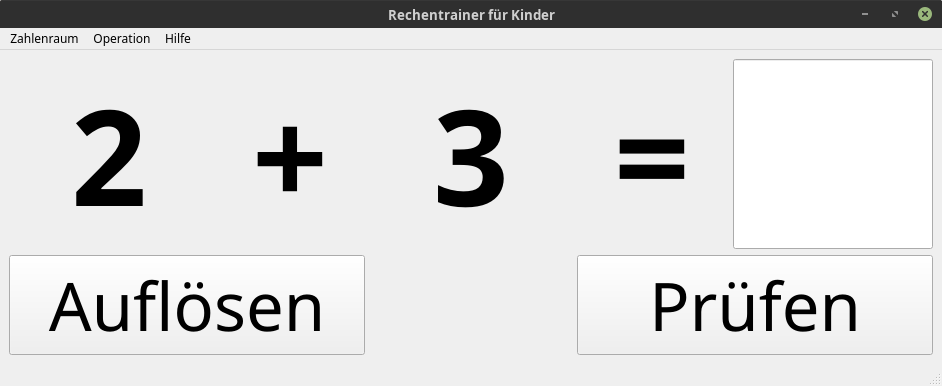
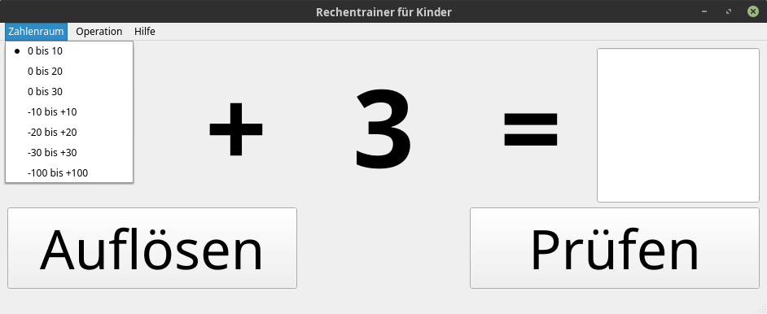
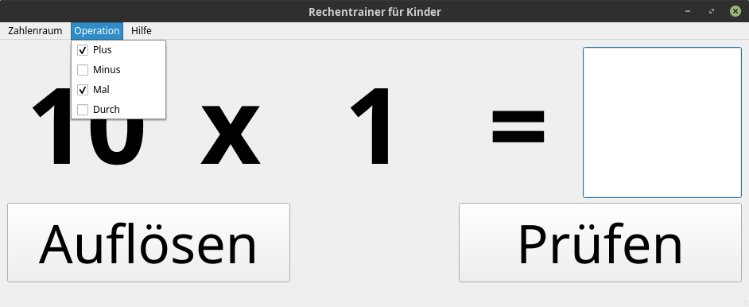

Rechentrainer für Kinder
========================

Dieser Rechentrainer ermöglicht das Erlernen einfacher bis schwieriger Rechenoperationen. 
Besonders die neutralen Elemente (0 für die Addition/Subraktion und 1 für die Multiplikation/Division) 
werden hier nicht außer Acht gelassen. 

Bei der Multiplikation und Division werden die Operanden auf 0 bis 10 eingeschränkt, evt. jedoch mit Vorzeichen. 

## Verschiedene Zahlenräume:

## Mehrere Rechenoperationen auswählbar:

## TODOs
* Einstellungen persistent ablegen
* Farbliche Markierung von richtig und falsch. 
* Statistik in der Statuszeile
* Wettbewerbsmodus: Auf Zeit mit Highscore
* breite der Felder für 4 Stellen (100 und Vorzeichen)
